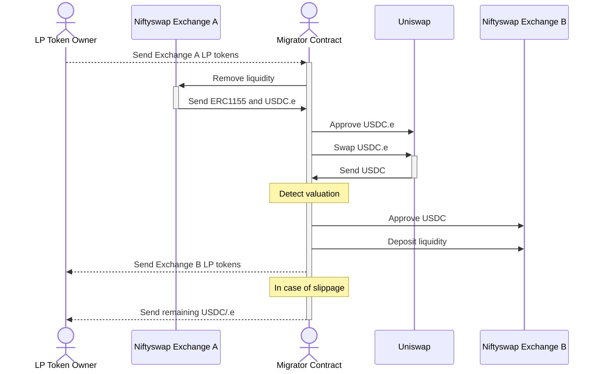

# Niftyswap Liquidity Migrator

The Niftyswap Liquidity Migrator is a tool that allows users to migrate their liquidity from one Niftyswap pool to another.
This is used by [Skyweaver](https://www.skyweaver.net/) to transfer liquidity from USDC.e to USDC.

## Process

In the below example, we will migrate liquidity from Niftyswap Exchange A to Niftyswap Exchange B.
NiftySwap Exchange A is the old pool that contains ERC1155 and USDC.e tokens, and Niftyswap Exchange B is the new pool that will contain ERC1155 and USDC tokens.



Note that this repository has been designed to cater for any ERC1155 and ERC20 tokens. USDC.e and USDC are used as an example.

Below is more information about each step in this process.

The data provided in the below steps is the `ILiquidityMigrator.MigrationData` struct. See the [ILiquidityMigrator.sol](src/ILiquidityMigrator.sol) file for the full specification. This struct is encoded using the `abi.encode` function. Note some values are used in multiple steps.

### Step 0: Create Exchange B

This process assumes that Exchange B has already been created and is not included in the above flow. Exchange B is the new pool that will contain ERC1155 and the new ERC20 tokens (in the above example USDC). Creating this pool is done by calling the `createExchange` function on the NiftyswapFactory contract.

In order to ensure consistent pricing when migrating liquidity, a new empty pool should be created.

### Step 1: Remove liquidity from Exchange A

The first step is to remove liquidity from Exchange A. The LP token owner sends their LP tokens to the Migrator contract with encoded data, which then calls the `removeLiquidity` function (by transferring the LP tokens) on Exchange A. This can be called with multiple LP tokens, and Niftyswap will manage the withdraw of each LP.

The data encoding contains the following parameters used in this step:

- `uint96 deadline` - The timestamp deadline for the transaction to be executed.
- `uint256[] minCurrencies` - The minimum amount of ERC20 for each LP token withdrawn.
- `uint256[] minTokens` - The minimum amount of ERC1155 tokens to be withdrawn.

### Step 2: Swap ERC20 tokens

The second step is to swap the the old ERC20 (USDC.e) for the new ERC20 (USDC). The Migrator contract will approve the the old token to Uniswap, and then perform the swap.

The data encoding contains the following parameters used in this step:

- `uint96 deadline` - The timestamp deadline for the transaction to be executed.
- `address erc20Router` - The address of the Uniswap router.
- `address erc20Old` - The address of the Old ERC20 token to be sent.
- `address erc20New` - The address of the New ERC20 token to be received.
- `uint24 swapFee` - The swap fee to be used in the Uniswap swap.
- `uint24 minSwapDelta` - Minimum amount of token to receive in the swap (as a percentage of the amount sent). 10000 = 100%

The `minSwapDelta` is a percentage of the amount sent. For example, if `minSwapDelta` is `10000`, then the minimum amount of tokens to receive is 100% of the amount sent. For stable coins a value of roughly `9990` is recommended (0.1% diff). For pairs where the value of coins vary significantly, use a suitably high / low value to match your price expectations.

### Step 3: Deposit liquidity into Exchange B

The third step is to deposit the new ERC20 (USDC) and ERC1155 tokens into Exchange B.This is a multi step process.

1. Check the total balance of new ERC20 tokens (USDC) held by the Migrator contract.
2. Calculate the value ratio the old ERC20 (USDC.e) and the new ERC20 (USDC) using the difference between the withdrawn balance of old ERC20 tokens and the swapped balance of old ERC20 tokens.
3. Apply this ratio across the ERC1155 tokens to calculate the deposit rate.
4. Approve the new ERC20 tokens (USDC) to Exchange B.
5. Deposit the new ERC20 tokens (USDC) and ERC1155 tokens into Exchange B.

The data encoding contains the following parameters used in this step:

- `uint96 deadline` - The timestamp deadline for the transaction to be executed.
- `address erc20New` - The address of the ERC20 token to be deposited.
- `address erc1155` - The address of the ERC1155 token to be deposited.
- `address exchangeNew` - The address of the Exchange B contract.

### Step 4: Recover tokens

The final step is to recover any remaining ERC20 tokens and newly minted LP tokens from the Migrator contract.

ERC20 tokens may remain in the Migrator contract the swap or LP deposit was not fully executed, rounding errors or slippage occurred.

The Migrator contract does not attempt to return any ERC1155 tokens or Old LP tokens. This is because these tokens are always transferred with exact values.

## Usage

### Install dependencies

```sh
git submodule update --init --recursive
yarn
yarn lint:init # For developers
```

### Run tests

```sh
yarn test
```

### Deploy the contracts

```sh
cp .env.example .env
# Manually update the .env file with the correct values
yarn run:deploy --fork-url https://rpc-mainnet.matic.quiknode.pro -vvvvv
# Again manually update the .env file with the values from the above deployment
```

Use the `--broadcast` flag to broadcast the transaction to the network.

### Run migration

Obtain suitable values for migration. This can be done manual or via the script.

When using these scripts, if your LP token holder is an EOA, populate the private key in the `SCRIPT_PK` variable.
If you are migrating tokens from a contract wallet (such as Sequence or Gnosis), populate the wallet address in the `LP_OWNER_ADDR` variable.
**Do not populate the `LP_OWNER_ADDR` variable if you want to be able to execute the transaction via forge with `--broadcast`.**

```sh
yarn run:prepare --fork-url https://rpc-mainnet.matic.quiknode.pro -vvvvv
# Check the output.json
```

If you prefer to construct the values manually, see `config.example.json` for example format.
Note that the object fields must be in alphabetical order for parsing.

Simulate a run of the migration:

```sh
yarn run:migrate --fork-url https://rpc-mainnet.matic.quiknode.pro -vvvvv
```

If you set a private key, use the `--broadcast` flag to broadcast the transaction to the network.
Otherwise, check the output file at `broadcast/MigrateLiquidity.s.sol/xxx/dry-run/run-latest.json` for the transaction data. Use this transaction data with your wallet provider to correctly sign and execute the transaction.

## License

All contracts in this repository are released under the Apache-2.0 license.
